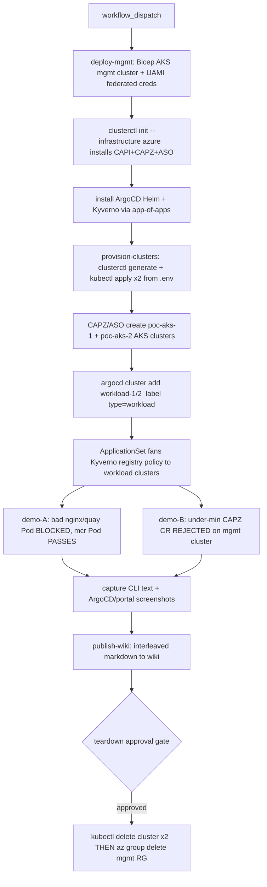

<!-- markdownlint-disable-file -->
# Task Research: Phase 1 PoC — Single-Subscription AKS Governance with CAPI/CAPZ/ASO + ArgoCD + Policy

A customer-demoable Phase 1 Proof of Concept, built inside the `aks-governance` repo, that mirrors the sibling `aks-fleet-manager` delivery pattern (one `workflow_dispatch` pipeline → deploy → demo → capture → publish-wiki → approval-gated teardown). Within a single Azure subscription it stands up a management cluster running CAPI/CAPZ/ASO + ArgoCD, declaratively provisions 2 workload AKS clusters from input YAML, and proves two governance controls: (A) deny `docker.io` + `quay.io` images, and (B) impose a minimum Kubernetes version. Proof is published to a wiki as interleaved CLI text + portal/ArgoCD screenshots. Teardown deletes everything to keep costs near-zero between demos.

## Task Implementation Requests

* Create a Phase 1 PoC in `aks-governance` using a single Azure subscription able to host a couple of AKS clusters.
* Provision a management cluster and use CAPI/CAPZ/ASO to create 2 workload AKS clusters from input YAMLs.
* Install ArgoCD and bootstrap GitOps onto the clusters.
* Demonstrate 2 governance examples:
  * Deny container images from `docker.io` and `quay.io`.
  * Impose a minimum Kubernetes version.
* Mirror the `aks-fleet-manager` approach: pipeline-driven, with cost-saving teardown.
* Provide proof via wiki screenshots; deliverable must be customer-demoable.

## Scope and Success Criteria

* Scope (in):
  * Single Azure subscription; AKS-only workload clusters.
  * A management cluster hosting CAPI core + CAPZ + ASO + ArgoCD.
  * 2 workload AKS clusters from parametrized input YAML (`aks-aso` CAPZ flavor).
  * Kyverno as the primary in-cluster policy engine; the two governance demos.
  * GitHub Actions pipeline mirroring `aks-fleet-manager` (OIDC, concurrency, artifact upload/download, approval-gated teardown).
  * Wiki proof via the sibling repo's `capture.ps1` + Playwright + `publish-wiki.ps1` chain.
* Scope (out, future phases):
  * ARO / Arc `connectedClusters` governance asymmetry (README flags this; Phase 2+).
  * Multi-subscription landing-zone-aligned ODS (README's strategic target).
  * Production HA ArgoCD, private clusters, custom VNet/CNI.
* Assumptions (decisions made where subagents asked clarifying questions):
  1. Phase 1 mirrors the Fleet Manager *delivery harness* (pipeline + single-RG + teardown + wiki), repurposed for governance. (repos question 1)
  2. Pipeline platform = GitHub Actions (sibling is GitHub-only; `publish-wiki.ps1` also supports `-Target ado` if needed later). (repos question 2)
  3. Single subscription confirmed; management infra in `rg-aksgov-poc-mgmt`, each workload cluster in its own CAPZ-created RG. (repos question 3)
  4. AKS-only for Phase 1. (repos question 4)
  5. Management cluster = a small ephemeral **AKS** cluster (not kind), provisioned per run via Bicep — chosen for native OIDC/workload-identity simplicity and a persistent, screenshot-able ArgoCD during the demo. (capi question 2; see Selected Approach + Alternatives)
  6. Auth = GitHub OIDC for the pipeline; Workload Identity (federated UAMI) for CAPZ/ASO, with SP+secret documented as the quick fallback. (capi question 1)
  7. The 2 workload clusters differ only by name/region (otherwise identical) to keep the demo simple; parametrized via per-cluster `.env` + `clusterctl generate`. (capi question 3)
  8. Default AKS networking (`azure` CNI), SystemAssigned cluster identity. (capi questions 4,5)
  9. Policy engine = Kyverno primary; Gatekeeper + Azure Policy shown as alternatives. (argocd question 6)
  10. Min-version enforced **in-cluster on the CAPZ control-plane CR via Kyverno** (semver-aware, instant demo) + optional Azure Policy approved-version allow-list as the Azure-native complement. (argocd question 3)
  11. Allow-list = `mcr.microsoft.com` + the customer ACR + `registry.k8s.io` (so cluster add-ons keep working). (argocd question 4)
  12. Demo runs Audit → flip to Enforce for the before/after screenshot narrative. (argocd question 5)
* Success Criteria:
  * One `workflow_dispatch` run provisions the management cluster, both workload clusters, ArgoCD, Kyverno, and both policies.
  * A bad Pod (`--image=nginx` and `--image=quay.io/...`) is **blocked** on workload clusters; a `mcr.microsoft.com/...` Pod **passes**.
  * A workload-cluster definition with `spec.version` below the minimum is **rejected** on the management cluster.
  * Wiki page is published with interleaved CLI evidence + ArgoCD/portal screenshots.
  * Approval-gated teardown removes all Azure resources (verified `az group delete` + no orphaned workload RGs).

## Outline

1. Repo reality check — what exists vs what must be authored.
2. Selected architecture — management AKS + CAPZ/ASO + ArgoCD + Kyverno, single subscription.
3. Pipeline harness mirrored from `aks-fleet-manager` (jobs, OIDC, teardown gate, wiki).
4. CAPI/CAPZ/ASO provisioning of 2 workload clusters from input YAML.
5. ArgoCD bootstrap + multi-cluster policy fan-out (ApplicationSet cluster generator).
6. Governance Example A — deny docker.io/quay.io (Kyverno, with Gatekeeper/Azure Policy alternatives).
7. Governance Example B — minimum Kubernetes version (Kyverno on CAPZ CR + Azure Policy).
8. Proof/wiki publishing + teardown ordering (cost safety).
9. Proposed repo file tree + implementation details.
10. Considered alternatives and open items.

## Potential Next Research

* Confirm the exact ASO `containerservice.azure.com/v1apiYYYYMMDD` date and bundled ASO version for the current CAPZ release; re-fetch `templates/cluster-template-aks-aso.yaml` at build time.
  * Reasoning: API versions are date-sensitive (today 2026-06-14) and the flavor template evolves.
  * Reference: .copilot-tracking/research/subagents/2026-06-14/capi-capz-aso-research.md section 8 + Open Items.
* Verify Kyverno chart version and whether `validationFailureAction` (policy-level) is replaced by per-rule `validate.failureAction` (Kyverno 1.12+).
  * Reasoning: the demo policies must match the installed chart's schema.
  * Reference: .copilot-tracking/research/subagents/2026-06-14/argocd-policy-research.md "Recommended Next Research".
* Decide/test the CAPI→ArgoCD cluster-Secret automation (kubeconfig→Secret job vs Sveltos vs cluster-api-addon-provider) end-to-end.
  * Reasoning: registering CAPZ workload clusters into ArgoCD is the linchpin for policy fan-out.
  * Reference: .copilot-tracking/research/subagents/2026-06-14/argocd-policy-research.md sections 2.2-2.3.
* Confirm the precise `spec.version` JSON path on `AzureASOManagedControlPlane` for the deployed API version.
  * Reasoning: the min-version Kyverno policy keys on this exact path.
  * Reference: .copilot-tracking/research/subagents/2026-06-14/argocd-policy-research.md section 5.2-5.4.
* Pin a region-valid AKS `KUBERNETES_VERSION` via `az aks get-versions` for the chosen region(s).
  * Reasoning: apply fails on an unsupported version.
  * Reference: .copilot-tracking/research/subagents/2026-06-14/capi-capz-aso-research.md section 8.
* Parse the binary `assets/*.docx`/`*.pptx` for any concrete phased roadmap the README omits (needs docx/pptx skill).
  * Reasoning: confirm Phase 1 framing aligns with the client deliverables.
  * Reference: .copilot-tracking/research/subagents/2026-06-14/repos-analysis-research.md "Recommended next research".
* Confirm a wiki publish target exists for `devopsabcs-engineering/aks-governance` (GitHub wiki enabled, or ADO project wiki).
  * Reasoning: `publish-wiki.ps1` needs a real target + `WIKI_PAT`.
  * Reference: .copilot-tracking/research/subagents/2026-06-14/repos-analysis-research.md wiki section.

## Research Executed

### File Analysis

* aks-governance/README.md
  * Prose executive brief ("Desjardins Kubernetes governance report delivered"); strategic recommendation toward a landing-zone-aligned multi-subscription ODS, with single-subscription as a tactical bootstrap. No numbered phases/roadmap. Documents AKS=`managedClusters` vs ARO/Arc=`connectedClusters` policy asymmetry; ArgoCD = GitOps reconciler, CAPZ/ASO = declarative AKS lifecycle; adds a "Fleet-governed distributed AKS operations" pattern.
* aks-governance/ (tree)
  * Documentation-only: `README.md` + four binary Office deliverables under `assets/`. No IaC, no pipelines, no scripts, no YAML. Phase 1 must be authored fresh.
* aks-fleet-manager/.github/workflows/fleet-poc-demo.yml
  * One `workflow_dispatch` pipeline; jobs: `deploy` (lines 72-105), `feature-a-upgrade` (107-138), `feature-b-policy` (140-163), `deploy-arc-members` (165-200), `feature-c-placement` (202-239), `verify-workloads` (241-300), `capture` (~302-330), `publish-wiki` (~332-388), `teardown` (~390-end). `permissions: id-token: write`; `concurrency: fleet-poc-<rg>`; rich inputs (10-58); teardown gated by `environment: fleet-poc-teardown` + `if: always() && needs.deploy.result=='success'`.
* aks-fleet-manager/infra/main.bicep
  * `targetScope = 'resourceGroup'`; loop-creates `Microsoft.ContainerService/managedClusters@2025-02-01` with inline `addonProfiles.azurepolicy.enabled = true`; `enableHub` cost toggle; eastus2 VM-size policy note (`Standard_D2s_v6` allowed, v3/v5 disallowed).
* aks-fleet-manager/scripts/teardown.ps1
  * Single `az group delete --name $ResourceGroup --yes --no-wait`; everything in one RG. Default `rg-fleet-poc`.
* aks-fleet-manager/scripts/deploy.ps1
  * `Connect-AzFederated` OIDC token re-mint loop for long deploys (avoids AADSTS700024); async `az deployment group create --no-wait` + 90s poll in CI; Fleet RBAC role grant by name (idempotent).
* aks-fleet-manager/scripts/capture.ps1 + docs/capture-fleet.ts + scripts/publish-wiki.ps1
  * Two-leg evidence: deterministic CLI text (`tee` of `az ...` into `docs/captures/*.txt`) + best-effort Playwright portal screenshots (reuses git-ignored `storage_state.json`). `publish-wiki.ps1` interleaves text+png by base name, builds Mermaid diagram + TOC, `https://PAT@host` auth via bash+macro, ADO (`/.attachments/`, `wikiMain`) vs GitHub (`images/`, `master`) handling.

### Code Search Results

* Pipeline stages / teardown / wiki publishing
  * All located in `aks-fleet-manager` with exact line references above (see subagent doc repos-analysis-research.md).
* `Phase 1` definition
  * Not present anywhere in `aks-governance` — confirmed by directory listing + README read.

### External Research

* CAPZ ASO-backed managed clusters (AzureASOManagedCluster/ControlPlane/MachinePool), `clusterctl init --infrastructure azure`, teardown via `kubectl delete cluster`.
  * Source: [CAPZ — ASO Managed Clusters](https://capz.sigs.k8s.io/managed/asomanagedcluster), [CAPI Quick Start](https://cluster-api.sigs.k8s.io/user/quick-start), [aks-aso flavor template](https://github.com/kubernetes-sigs/cluster-api-provider-azure/blob/main/templates/cluster-template-aks-aso.yaml)
* ASO v2 authentication (workload identity / SP / IMDS), credential scope/secret format, crdPattern.
  * Source: [ASO Authentication](https://azure.github.io/azure-service-operator/guide/authentication/), [Credential format](https://azure.github.io/azure-service-operator/guide/authentication/credential-format/)
* ArgoCD install (Helm vs manifests vs Operator), app-of-apps, cluster Secrets, ApplicationSet cluster generator.
  * Source: [ArgoCD Getting Started](https://argo-cd.readthedocs.io/en/stable/getting_started/), [Cluster Bootstrapping](https://argo-cd.readthedocs.io/en/stable/operator-manual/cluster-bootstrapping/), [ApplicationSet Cluster Generator](https://argo-cd.readthedocs.io/en/stable/operator-manual/applicationset/Generators-Cluster/)
* Kyverno deny.conditions over parsed `images.*.registry`; Restrict Image Registries; semver operators for CR version.
  * Source: [Kyverno Restrict Image Registries](https://kyverno.io/policies/best-practices/restrict-image-registries/restrict-image-registries/)
* Gatekeeper library `k8sallowedrepos`; Azure Policy AKS built-ins (Audit-only version policy; no numeric-min Deny built-in).
  * Source: [Gatekeeper Library — Allowed Repositories](https://open-policy-agent.github.io/gatekeeper-library/website/validation/allowedrepos/), [Azure Policy built-ins for AKS](https://learn.microsoft.com/en-us/azure/aks/policy-reference)

### Project Conventions

* Standards referenced: `aks-fleet-manager` conventions — single-RG `rg-*-poc` naming, `eastus2`, GitHub OIDC secrets (`AZURE_CLIENT_ID`/`AZURE_TENANT_ID`/`AZURE_SUBSCRIPTION_ID` + `WIKI_PAT`), approval-gated `*-teardown` GitHub Environment, pwsh 7 scripts.
* Instructions followed: user memory — literal `&` (not `&amp;`) in pwsh; `Select-String` not `grep`; ADO wiki git auth via bash + `https://PAT@host` macro substitution; `WIKI_PAT` needs Code (Read & write).

## Key Discoveries

### Project Structure

* `aks-governance` is documentation-only today; the entire PoC (infra, scripts, pipeline, gitops, manifests) is greenfield. The directly reusable blueprint is `aks-fleet-manager`'s deploy→demo→capture→publish→teardown harness — copy and re-parameterize, swapping Fleet-specific logic for CAPI/CAPZ/ASO + ArgoCD + Kyverno.

### Implementation Patterns

* The sibling's **always-run-but-approval-gated teardown** (`if: always() && needs.deploy.result=='success'` behind a required-reviewer GitHub Environment) is the key cost-safety pattern to keep — it cleans up even when demo jobs fail, but never deletes without a human click.
* The **two-leg evidence model** (deterministic CLI `.txt` + best-effort Playwright `.png`, interleaved by base filename) is fully generic; only the captured commands (CAPI/ArgoCD/kubectl instead of `az fleet`) and the portal/ArgoCD deep-links change.
* CAPZ `aks-aso` flavor + `clusterctl generate cluster` is the cleanest parametrization for 2 near-identical workload clusters (per-cluster `.env`, loop apply).
* Kyverno's parsed `images.*.registry` resolves the implicit `docker.io` default and `library/` prefix natively — the exact correctness property the docker.io/quay.io demo needs.
* Minimum-K8s-version is a **cluster-level** control: enforce it on the CAPZ control-plane CR (`spec.version`) with Kyverno on the management cluster (semver-aware) and/or an Azure Policy approved-version allow-list (Azure Policy has no semver comparator, so allow-list, not `less`).

### Complete Examples

CAPZ `aks-aso` workload-cluster manifest (parametrized; one per workload cluster):

```yaml
apiVersion: cluster.x-k8s.io/v1beta1
kind: Cluster
metadata:
  name: ${CLUSTER_NAME}
  namespace: default
spec:
  controlPlaneRef:
    apiVersion: infrastructure.cluster.x-k8s.io/v1beta1
    kind: AzureASOManagedControlPlane
    name: ${CLUSTER_NAME}
  infrastructureRef:
    apiVersion: infrastructure.cluster.x-k8s.io/v1beta1
    kind: AzureASOManagedCluster
    name: ${CLUSTER_NAME}
---
apiVersion: infrastructure.cluster.x-k8s.io/v1beta1
kind: AzureASOManagedControlPlane
metadata:
  name: ${CLUSTER_NAME}
  namespace: default
spec:
  version: ${KUBERNETES_VERSION}     # <-- enforced >= minimum by Kyverno (Example B)
  resources:
  - apiVersion: containerservice.azure.com/v1api20240901
    kind: ManagedCluster
    metadata:
      annotations:
        serviceoperator.azure.com/credential-from: ${ASO_CREDENTIAL_SECRET_NAME}
      name: ${CLUSTER_NAME}
    spec:
      dnsPrefix: ${CLUSTER_NAME}
      identity: { type: SystemAssigned }
      location: ${AZURE_LOCATION}
      networkProfile: { networkPlugin: azure }
      owner: { name: ${CLUSTER_NAME} }
      servicePrincipalProfile: { clientId: msi }
---
apiVersion: infrastructure.cluster.x-k8s.io/v1beta1
kind: AzureASOManagedCluster
metadata:
  name: ${CLUSTER_NAME}
  namespace: default
spec:
  resources:
  - apiVersion: resources.azure.com/v1api20200601
    kind: ResourceGroup
    metadata:
      annotations:
        serviceoperator.azure.com/credential-from: ${ASO_CREDENTIAL_SECRET_NAME}
      name: ${CLUSTER_NAME}
    spec:
      location: ${AZURE_LOCATION}
# + MachinePool / AzureASOManagedMachinePool (System pool) — see subagent capi-capz-aso-research.md section 1.2
```

Kyverno Example A — deny docker.io + quay.io (registry-aware):

```yaml
apiVersion: kyverno.io/v1
kind: ClusterPolicy
metadata:
  name: block-docker-quay-registries
spec:
  validationFailureAction: Enforce      # Audit first, then flip to Enforce for the demo
  background: true
  rules:
    - name: block-registries
      match: { any: [ { resources: { kinds: [Pod] } } ] }
      validate:
        message: >-
          Images from docker.io and quay.io are not allowed.
          Use mcr.microsoft.com or your ACR (<name>.azurecr.io).
        deny:
          conditions:
            any:
              - key: "{{ images.containers.*.registry || `[]` }}"
                operator: AnyIn
                value: ["docker.io", "quay.io"]
              - key: "{{ images.initContainers.*.registry || `[]` }}"
                operator: AnyIn
                value: ["docker.io", "quay.io"]
              - key: "{{ images.ephemeralContainers.*.registry || `[]` }}"
                operator: AnyIn
                value: ["docker.io", "quay.io"]
```

Kyverno Example B — minimum K8s version on the management cluster (validates CAPZ CR):

```yaml
apiVersion: kyverno.io/v1
kind: ClusterPolicy
metadata:
  name: enforce-min-k8s-version
spec:
  validationFailureAction: Enforce
  background: false
  rules:
    - name: capz-control-plane-min-version
      match:
        any:
          - resources:
              kinds: [AzureManagedControlPlane, AzureASOManagedControlPlane, KubeadmControlPlane]
      validate:
        message: "Workload clusters must run Kubernetes v1.28.0 or newer."
        deny:
          conditions:
            any:
              - key: "{{ request.object.spec.version }}"
                operator: LessThan
                value: "v1.28.0"
```

### API and Schema Documentation

* CAPZ ASO-backed managed clusters: `infrastructure.cluster.x-k8s.io/v1beta1` (`AzureASOManagedCluster`/`ControlPlane`/`MachinePool`); default-on (`ASOAPI`/`EXP_ASO_API`), requires `MachinePool=true`. Embedded ASO: `containerservice.azure.com/v1api20240901` (ManagedCluster, ManagedClustersAgentPool), `resources.azure.com/v1api20200601` (ResourceGroup). Source: [CAPZ ASO Managed Clusters](https://capz.sigs.k8s.io/managed/asomanagedcluster).
* ArgoCD cluster Secret label `argocd.argoproj.io/secret-type: cluster`; ApplicationSet cluster generator selects workload clusters by custom label, naturally excludes the in-cluster target. Source: [ApplicationSet Cluster Generator](https://argo-cd.readthedocs.io/en/stable/operator-manual/applicationset/Generators-Cluster/).
* Azure Policy for AKS: built-in "upgrade to non-vulnerable version" is **Audit-only**; no numeric-minimum Deny built-in; custom policy on `Microsoft.ContainerService/managedClusters/kubernetesVersion` must use an approved-version allow-list (`in`), not `less` (no semver comparator). Source: [Azure Policy built-ins for AKS](https://learn.microsoft.com/en-us/azure/aks/policy-reference).

### Configuration Examples

Per-cluster `.env` (parametrization for the 2 workload clusters):

```bash
# clusters/poc-aks-1.env
CLUSTER_NAME=poc-aks-1
AZURE_LOCATION=eastus2
KUBERNETES_VERSION=v1.30.3
WORKER_MACHINE_COUNT=2
AZURE_NODE_MACHINE_TYPE=Standard_D2s_v6
ASO_CREDENTIAL_SECRET_NAME=aso-credentials
# clusters/poc-aks-2.env  -> CLUSTER_NAME=poc-aks-2, AZURE_LOCATION=westus3 (else identical)
```

GitHub OIDC + secrets (mirrors sibling): repo secrets `AZURE_CLIENT_ID`, `AZURE_TENANT_ID`, `AZURE_SUBSCRIPTION_ID`, `WIKI_PAT`; GitHub Environment `aksgov-poc-teardown` with required reviewers.

## Technical Scenarios

### Phase 1 PoC — Single-Subscription AKS Governance Demo

A single GitHub Actions `workflow_dispatch` pipeline provisions an ephemeral management AKS cluster, installs CAPI/CAPZ/ASO + ArgoCD + Kyverno, declaratively creates 2 workload AKS clusters from input YAML, fans the governance policies out to them via ArgoCD, demonstrates both controls (registry deny + min-version), captures CLI + screenshot evidence, publishes a wiki page, then (approval-gated) tears everything down.

**Requirements:**

* Single Azure subscription; GitHub OIDC for pipeline auth; Workload Identity (UAMI + federated credentials) for CAPZ/ASO.
* Management AKS cluster (small, single B-series system pool) in `rg-aksgov-poc-mgmt`.
* 2 workload AKS clusters via CAPZ `aks-aso` flavor, each in its own CAPZ-created RG.
* ArgoCD (Helm) on the management cluster; Kyverno (Helm) on management + workload clusters via ArgoCD ApplicationSet.
* Two Kyverno policies (registry deny on workload clusters; min-version on management cluster CRs).
* Reused capture/publish-wiki chain from `aks-fleet-manager`.

**Preferred Approach:**

* **Ephemeral management AKS cluster** (not kind) per run, provisioned via Bicep. Rationale: native OIDC issuer makes Workload Identity for CAPZ/ASO trivial (kind requires brittle JWKS-in-storage + custom SA keypair); ArgoCD is reachable (LoadBalancer/port-forward) for live customer demo and clean screenshots; Bicep provisioning mirrors the sibling repo pattern the user asked to follow; closer to the README's strategic direction. Cost is bounded because the pipeline tears everything down (approval-gated) at the end — nothing runs between demos.
* **Kyverno** primary policy engine (readable YAML, registry-aware image parsing, semver operators, instant Audit⇄Enforce toggle); Gatekeeper + Azure Policy presented as alternatives for the customer.
* **Teardown ordering is mandatory**: `kubectl delete cluster poc-aks-1 poc-aks-2` first (cascades CAPI→CAPZ→ASO→Azure RG deletion of the workload clusters), wait for their RGs to disappear, then `az group delete` the management RG. Destroying the management cluster first orphans the workload AKS clusters (they keep billing).

```text
aks-governance/
├─ .github/
│  └─ workflows/
│     └─ aksgov-poc-demo.yml          # deploy → bootstrap → provision → demo-A → demo-B → capture → publish-wiki → teardown
├─ infra/
│  └─ mgmt-cluster.bicep              # ephemeral mgmt AKS + UAMI + federated creds (adapts main.bicep)
├─ clusters/
│  ├─ poc-aks-1.env                   # parametrization inputs (input YAML drivers)
│  ├─ poc-aks-2.env
│  └─ cluster-template-aks-aso.yaml   # checked-in CAPZ aks-aso template (envsubst/clusterctl)
├─ gitops/
│  ├─ bootstrap/root-app.yaml         # app-of-apps root
│  ├─ apps/
│  │  ├─ kyverno.yaml                 # Application: install Kyverno (Helm, sync-wave 0)
│  │  └─ governance-policies.yaml     # ApplicationSet: fan Kyverno policies to workload clusters (wave 1)
│  └─ policies/kyverno/
│     ├─ block-docker-quay-registries.yaml
│     └─ enforce-min-k8s-version.yaml # applied to mgmt cluster CRs
├─ scripts/
│  ├─ deploy-mgmt.ps1                 # az deployment + get-credentials + clusterctl init + ASO creds + ArgoCD install
│  ├─ provision-clusters.ps1          # loop .env → clusterctl generate → kubectl apply → get kubeconfig → argocd cluster add
│  ├─ demo-registry.ps1              # apply bad/good Pods, capture block output  (Example A)
│  ├─ demo-min-version.ps1           # apply under-min CAPZ CR, capture rejection (Example B)
│  ├─ capture.ps1                     # CLI text + Playwright (adapted from sibling)
│  ├─ publish-wiki.ps1               # reused near-verbatim from sibling
│  └─ teardown.ps1                    # kubectl delete cluster (ordered) THEN az group delete
└─ docs/
   ├─ capture-argocd.ts              # Playwright: ArgoCD UI + portal deep-links
   ├─ captures/                       # committed sample evidence (.txt)
   └─ screenshots/                    # committed sample evidence (.png)
```



**Implementation Details:**

* `aksgov-poc-demo.yml` mirrors `fleet-poc-demo.yml`: `permissions: id-token: write`; `concurrency: aksgov-poc-<rg>`; `workflow_dispatch` inputs (`resourceGroup` default `rg-aksgov-poc-mgmt`, `location` default `eastus2`, `minK8sVersion` default `v1.28.0`, `kubernetesVersion`, booleans `runCapture`/`publishWiki`/`auditFirst`); `teardown` job `if: always() && needs.deploy.result=='success'` behind `environment: aksgov-poc-teardown`.
* `deploy-mgmt.ps1` reuses the sibling's `Connect-AzFederated` OIDC re-mint loop for the long AKS provisioning, then `az aks get-credentials`, `clusterctl init --infrastructure azure`, applies the ASO credential Secret, and `helm install argocd` + applies `gitops/bootstrap/root-app.yaml`.
* `provision-clusters.ps1` loops the `.env` files, runs `clusterctl generate cluster --flavor aks-aso`, `kubectl apply`, waits, `clusterctl get kubeconfig`, then registers each workload cluster as an ArgoCD cluster Secret labeled `type: workload` (kubeconfig→Secret job).
* Example A delivered to workload clusters via the ApplicationSet cluster generator (`matchLabels: {type: workload}`), naturally excluding the management cluster. Example B applied directly on the management cluster (validates CAPZ CRs).
* Demo narrative: deploy policies as `Audit` first (`kubectl get policyreport -A` shows violations without blocking), capture screenshot, then a git commit flips to `Enforce`, ArgoCD self-heals, re-apply bad Pod → blocked → capture the denial.
* Allow-list MCR + ACR + `registry.k8s.io` so cluster add-ons (cert-manager, ingress) keep pulling.

```yaml
# gitops/apps/governance-policies.yaml — fan policies to every workload cluster
apiVersion: argoproj.io/v1alpha1
kind: ApplicationSet
metadata: { name: governance-policies, namespace: argocd }
spec:
  goTemplate: true
  generators:
    - clusters: { selector: { matchLabels: { type: workload } } }
  template:
    metadata: { name: 'policies-{{.name}}' }
    spec:
      project: default
      source:
        repoURL: https://github.com/devopsabcs-engineering/aks-governance.git
        targetRevision: HEAD
        path: gitops/policies/kyverno
      destination: { server: '{{.server}}', namespace: kyverno }
      syncPolicy:
        automated: { prune: true, selfHeal: true }
        syncOptions: [ CreateNamespace=true, ServerSideApply=true ]
```

#### Considered Alternatives

* **kind management cluster on the runner** (subagent capi-capz-aso-research.md section 3) — fully ephemeral, zero standing Azure cost, what upstream quick-starts use. Rejected as primary because: (1) Workload Identity on kind is heavy/brittle (requires generating an SA signing keypair and publishing a JWKS discovery doc to Azure storage); (2) ArgoCD only exists for the duration of the runner job, making live customer demos and stable screenshots harder; (3) teardown ordering is more fragile (destroying kind orphans workload AKS). Still a valid lower-cost variant — keep as a documented Option B and could be offered as a pipeline input toggle.
* **Classic (non-ASO) CAPZ `AzureManagedControlPlane`** instead of the ASO-backed flavor — GA and slightly simpler, but exposes only a CAPZ-curated subset of AKS fields and is the older path; the ASO-backed flavor is the current recommended direction and gives full AKS field access. Min-version policy works on either CR kind.
* **Gatekeeper (OPA)** as the policy engine — battle-tested `k8sallowedrepos` allow-list, but Rego is unfamiliar to customers and prefix matching does not auto-resolve the implicit `docker.io`/`library/` default (must list `index.docker.io`/`registry-1.docker.io` manually). Kept as the documented alternative; note Azure Policy for AKS is Gatekeeper under the hood.
* **Azure Policy add-on** for the registry control — Azure-native compliance dashboard, but ~15-min sync, control-plane scoped, and overlapping Pod-level enforcement with Kyverno causes double webhooks. Recommended only for cluster-level/compliance (and the min-version approved-version allow-list), not for the live Pod-deny demo.
* **Azure DevOps pipelines** instead of GitHub Actions — `publish-wiki.ps1` already supports `-Target ado` and user memory documents ADO wiki git auth. Deferred: sibling is GitHub-only, so GitHub Actions is the lowest-friction mirror; ADO remains a drop-in alternative if the customer requires it.
