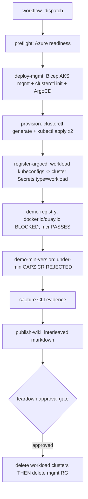

# AKS Governance PoC — Operations Runbook

End-to-end runbook for the AKS Governance proof of concept: an ephemeral
Cluster API (CAPI/CAPZ/ASO) management cluster that provisions two workload AKS
clusters, fans Kyverno governance policies to them via ArgoCD, and demonstrates
two enforcement examples before an approval-gated teardown.

The same flow runs two ways:

- **Local-first** — run the `scripts/*.ps1` by hand against your own `az login`.
- **Pipeline** — `.github/workflows/aksgov-poc-demo.yml` orchestrates every script
  with OIDC federated login and an approval gate on teardown.

> Cost note: this PoC creates a management AKS cluster plus two workload AKS
> clusters. Always run the teardown when the demo is finished. The pipeline
> teardown runs automatically (behind approval) even when earlier jobs fail.

## Contents

- [Architecture at a glance](#architecture-at-a-glance)
- [Required GitHub secrets](#required-github-secrets)
- [Create the OIDC app registration](#create-the-oidc-app-registration)
- [The aksgov-poc-teardown environment](#the-aksgov-poc-teardown-environment)
- [Wiki target + WIKI_PAT](#wiki-target--wiki_pat)
- [Local-first run order](#local-first-run-order)
- [Running the pipeline](#running-the-pipeline)
- [Audit to Enforce demo narrative](#audit-to-enforce-demo-narrative)
- [Customer-demo walkthrough](#customer-demo-walkthrough)

## Architecture at a glance



## Required GitHub secrets

Configure these under repo **Settings -> Secrets and variables -> Actions**:

| Secret | Purpose |
| --- | --- |
| `AZURE_CLIENT_ID` | Application (client) ID of the OIDC app registration. |
| `AZURE_TENANT_ID` | Microsoft Entra tenant ID. |
| `AZURE_SUBSCRIPTION_ID` | Target subscription for all PoC resources. |
| `WIKI_PAT` | GitHub PAT with **Code (Read & write)** scope for wiki publish (only needed when `publishWiki` is true). |
| `ARGOCD_GIT_PAT` | _Optional but recommended for internal/private repos._ Durable git credential (fine-grained PAT or GitHub App token with **Contents: Read-only** on this repo) seeded into ArgoCD so the app-of-apps root Application can keep pulling after the workflow ends. Without it the pipeline falls back to the ephemeral `github.token`, which is revoked when the job finishes — so ArgoCD's root app sits in `Unknown` and the GitOps fan-out (ApplicationSets) never reconciles policies onto the workload clusters. |

The pipeline authenticates to Azure with `azure/login@v2` using OIDC (federated
credentials) — no client secret is stored.

## Create the OIDC app registration

Run these once with an account that can create app registrations and assign roles
on the target subscription. Replace placeholders before running.

```bash
# 0. Variables
SUBSCRIPTION_ID="<your-subscription-id>"
APP_NAME="aksgov-poc-oidc"
REPO="devopsabcs-engineering/aks-governance"

az account set --subscription "$SUBSCRIPTION_ID"

# 1. Create the app registration + service principal
APP_ID=$(az ad app create --display-name "$APP_NAME" --query appId -o tsv)
az ad sp create --id "$APP_ID"
SP_OBJECT_ID=$(az ad sp show --id "$APP_ID" --query id -o tsv)
TENANT_ID=$(az account show --query tenantId -o tsv)

echo "AZURE_CLIENT_ID       = $APP_ID"
echo "AZURE_TENANT_ID       = $TENANT_ID"
echo "AZURE_SUBSCRIPTION_ID = $SUBSCRIPTION_ID"

# 2. Role assignments (subscription scope).
#    Owner is used because the PoC creates UAMIs and role assignments for ASO
#    Workload Identity. Scope down to Contributor + User Access Administrator if
#    your governance posture requires least privilege.
az role assignment create \
  --assignee-object-id "$SP_OBJECT_ID" \
  --assignee-principal-type ServicePrincipal \
  --role "Owner" \
  --scope "/subscriptions/$SUBSCRIPTION_ID"

# 3. Federated credential for the main branch (preflight/deploy/demo jobs).
az ad app federated-credential create --id "$APP_ID" --parameters '{
  "name": "aksgov-poc-main",
  "issuer": "https://token.actions.githubusercontent.com",
  "subject": "repo:devopsabcs-engineering/aks-governance:ref:refs/heads/main",
  "audiences": ["api://AzureADTokenExchange"]
}'

# 4. Federated credential for the approval-gated teardown environment.
#    GitHub mints a DIFFERENT subject for environment-scoped jobs, so the teardown
#    job needs its own federated credential or it will fail OIDC login.
az ad app federated-credential create --id "$APP_ID" --parameters '{
  "name": "aksgov-poc-teardown-env",
  "issuer": "https://token.actions.githubusercontent.com",
  "subject": "repo:devopsabcs-engineering/aks-governance:environment:aksgov-poc-teardown",
  "audiences": ["api://AzureADTokenExchange"]
}'
```

After this, set `AZURE_CLIENT_ID`, `AZURE_TENANT_ID`, and `AZURE_SUBSCRIPTION_ID`
as GitHub Actions secrets (values printed in step 1).

> If you run the pipeline from branches other than `main`, add a federated
> credential whose `subject` matches that ref (for example
> `repo:devopsabcs-engineering/aks-governance:ref:refs/heads/<branch>`).

## The aksgov-poc-teardown environment

The teardown job references `environment: aksgov-poc-teardown`, which pauses the
run until a reviewer approves the destroy.

1. Repo **Settings -> Environments -> New environment** -> name it
   `aksgov-poc-teardown`.
2. Enable **Required reviewers** and add the people allowed to approve teardown.
3. (Optional) Add a **wait timer** or **deployment branch** rule.

The federated credential created in step 4 above matches this environment's OIDC
subject so the teardown job can still log in to Azure after approval.

## Wiki target + WIKI_PAT

Wiki publish is optional (`publishWiki` input, default `false`).

1. Create the first wiki page in the GitHub UI so the wiki Git repo exists:
   `https://github.com/devopsabcs-engineering/aks-governance/wiki`.
2. Create a PAT with **Code (Read & write)** (classic: `repo` scope; fine-grained:
   Contents Read and write on this repo). Wiki-only scope is **not** sufficient —
   GitHub wikis are Git repositories.
3. Save it as the `WIKI_PAT` secret.

`scripts/publish-wiki.ps1` authenticates with the PAT-in-URL form
(`https://PAT@host/...`) against
`https://github.com/devopsabcs-engineering/aks-governance.wiki.git`.

Validate the target before a real publish:

```powershell
pwsh -File scripts/publish-wiki.ps1 -Target github `
  -WikiRepoUrl 'https://github.com/devopsabcs-engineering/aks-governance.wiki.git' `
  -Preflight
```

## Local-first run order

Run these in order from the repo root against your own `az login` session
(PowerShell 7+, Azure CLI, `kubectl`, `helm`, and `clusterctl` on PATH):

```powershell
az login
az account set --subscription '<your-subscription-id>'

# 1. Read-only readiness checks (auto-registers missing providers)
pwsh -File scripts/preflight.ps1 -Location eastus2 -WorkloadLocation2 westus3

# 2. Management cluster: Bicep + clusterctl init + ArgoCD app-of-apps
pwsh -File scripts/deploy-mgmt.ps1 `
  -ResourceGroup rg-aksgov-poc-mgmt -Location eastus2 `
  -SubscriptionId '<your-subscription-id>'

# 3. Provision the workload AKS clusters from clusters/*.env
pwsh -File scripts/provision-clusters.ps1 -ClustersDir clusters

# 4. Register the workload clusters into ArgoCD (labels type=workload)
pwsh -File scripts/register-argocd-clusters.ps1 -KubeconfigDir kubeconfigs -ArgoNamespace argocd

# 5. Example A — registry deny (Audit first, then Enforce: see narrative below)
pwsh -File scripts/demo-registry.ps1 -CaptureDir docs/captures -ExpectAudit  # Audit pass
pwsh -File scripts/demo-registry.ps1 -CaptureDir docs/captures               # Enforce pass

# 6. Example B — minimum Kubernetes version reject (validated on the mgmt cluster)
pwsh -File scripts/demo-min-version.ps1 -CaptureDir docs/captures

# 7. Capture CLI evidence (and optional screenshots)
pwsh -File scripts/capture.ps1 -ResourceGroup rg-aksgov-poc-mgmt `
  -MgmtClusterName aksgov-poc-mgmt -CaptureDir docs/captures -ScreenshotDir docs/screenshots

# 8. (Optional) publish the walkthrough
pwsh -File scripts/publish-wiki.ps1 -Target github `
  -WikiRepoUrl 'https://github.com/devopsabcs-engineering/aks-governance.wiki.git'

# 9. Cost-safe teardown (workload clusters first, THEN the mgmt RG)
pwsh -File scripts/teardown.ps1 -ResourceGroup rg-aksgov-poc-mgmt -ClustersDir clusters
```

> `-MgmtClusterName aksgov-poc-mgmt` matches the Bicep cluster name. The teardown
> always deletes workload clusters before the management RG so CAPI/CAPZ can
> finalize their deletion and nothing keeps billing.

## Running the pipeline

1. Configure the secrets, OIDC app, and `aksgov-poc-teardown` environment above.
2. **Actions -> aksgov-poc-demo -> Run workflow**.
3. Set inputs:
   - `resourceGroup` (default `rg-aksgov-poc-mgmt`)
   - `location` (default `eastus2`), `workloadLocation2` (default `westus3`)
   - `minK8sVersion` (default `v1.28.0`), `kubernetesVersion` (empty = AKS default)
   - `runCapture` (default true), `publishWiki` (default false), `auditFirst` (default true)
4. Watch the job graph: `preflight -> deploy-mgmt -> provision -> register-argocd ->
   demo-registry -> demo-min-version -> capture -> publish-wiki -> teardown`.
5. When the run reaches **teardown**, approve it in the environment prompt to
   destroy the clusters and resource groups.

Each job installs only the tools it needs (`kubectl` via `az aks install-cli`,
`helm`, `clusterctl`) and passes kubeconfigs/captures between jobs as artifacts.
Failed demo jobs still upload their diagnostic captures (`if: always()`).

## Audit to Enforce demo narrative

The governance examples land as **Audit** first, then flip to **Enforce** — the
core message that policy can observe before it blocks.

1. **Audit** — policies sync in Audit mode. Apply a `docker.io`/`quay.io` Pod and
   it is **admitted**, but `kubectl get policyreport -A` records the violation.
   In the pipeline this is the default path (`auditFirst: true` →
   `demo-registry.ps1 -ExpectAudit`). Capture the PolicyReport screenshot.
2. **Flip to Enforce** — a single Git commit changes the policy
   `validationFailureAction` from `Audit` to `Enforce`. ArgoCD self-heals and
   reconciles the change to the workload clusters.
3. **Enforce** — re-apply the same bad Pod; admission now **denies** it. Capture
   the denial. The allow-listed `mcr.microsoft.com` Pod still passes throughout,
   so add-ons keep pulling.
4. **Example B** — apply an under-minimum-version CAPZ cluster CR on the
   management cluster; the `enforce-min-k8s-version` policy **rejects** it.

## Customer-demo walkthrough

A ~15-minute live narrative:

1. **Frame the problem** (1 min) — "We need consistent guardrails across every AKS
   cluster, applied from one place, with proof before enforcement."
2. **Show the management plane** (2 min) — ArgoCD UI: the app-of-apps and the
   governance ApplicationSet fanning policies to clusters labeled `type=workload`.
   The management cluster is excluded by the label selector.
3. **Example A — Audit** (3 min) — apply the `docker.io`/`quay.io` Pods; they are
   admitted; show the PolicyReport violations. Message: "Observe first, no outage."
4. **Flip to Enforce** (2 min) — commit the `Audit -> Enforce` change; watch ArgoCD
   self-heal. Message: "Governance is Git-driven and auditable."
5. **Example A — Enforce** (2 min) — re-apply the bad Pod -> denied; the
   `mcr.microsoft.com` Pod still passes. Message: "Allow-list keeps platform
   add-ons working."
6. **Example B — version floor** (2 min) — apply an under-minimum CAPZ cluster CR
   -> rejected at the management cluster. Message: "Guardrails extend to cluster
   provisioning, not just workloads."
7. **Evidence + teardown** (2 min) — show the captured CLI text / wiki page, then
   trigger the approval-gated teardown. Message: "Reproducible, auditable, and
   cost-safe — it cleans itself up behind an approval."
